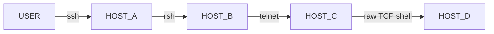
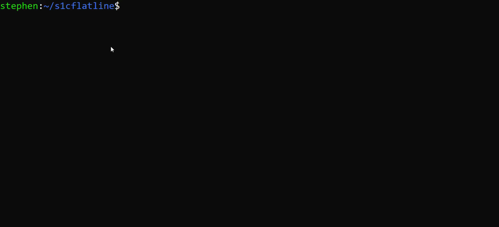

# The Flatline (s1cflatline)
s1cFlatline was [written in 2003](https://sourceforge.net/projects/s1cflatline/files/) but is suprisingly still useful today. It runs silently in your terminal (like `screen` or `tmux`). As you "bounce" from system to system (forming a chain of remote terminal connections), it enables remote file upload and download "IN BAND" without requiring a separate file transfer connection to (or from) the target system. This assists with stealthiness as remote systems may be monitored for connection history, or in circumstances where a remote system is not permitted to initiate egress connections. The [original README](./README) might explain this more clearly.

Principally s1cflatline acts as a terminal logger (nothing new) but s1cFlatline futher provides a special file (a FIFO) when executed on your main host (before connecting to other systems). Anything written into that file, is written into the active terminal session "in-band" as if you'd typed on the keyboard directly into that terminal. This allows for some degree of terminal automation external to the active terminal session. This can be particularly useful over slow links.

# Building/Compiling
s1cflatline was always meant to be portable. Working on BSD and Linux systems of the time. Due to compiler and chip architecture changes since it was written (introduction of 64bit for example), the build is not as simple as `make` of the old README.

Instead, you may now have to run `make CFLAGS=-DSVR4=1` like so:

 ([MP4 version](README_md_files/s1cflatline_compile_flags_demo.mp4))

**NOTE:** <ins>I have noticed issues with SOME modern compilers and 64-bit systems and plan to fix/debug it so it can be as easily useful/compilable EVERYWHERE as it was back then.</ins>

# The Original README
Written and circulated privately in early 2000s before being publicly [posted to Sourceforge](https://sourceforge.net/projects/s1cflatline/files/) in 2003. Although the [Sourceforge link](https://sourceforge.net/projects/s1cflatline/files/) is still live (at the time of this README), who knows how much longer Sourceforge will be, so this Github repo is meant as a backup. 

The original README.TXT is [preserved here](./README).

# How it was named:
Dixie Flatline is a character from William Gibson's "Neuromancer". In the book's lore, it was a neural-network recording of the best hacker, who assisted the protagonist (Case) as he performed all the technical feats in the book's plot. The neural-recording (called a "construct") was an EXTREMELY valuable one-of-a-kind dataset kept deep in offline top-secret data vaults. Case and his team are first tasked with breaking-in and stealing the Flatline's "construct" so that The Flatline assist Case as he continued with his larger mission. Once obtained, Dixie Flatline would metaphorically look over Case's shoulder to assist Case with his exploits in cyberspace.

https://github.com/user-attachments/assets/c29e45b4-5d76-4b1d-b9db-d5583f1e2fb5

(pure [MP3 version](README_md_files/CaseFirstRunOfDixieConstruct.mp3) of this clip)
These clips are taken from [this BBC's 2003 Radio-play version](https://archive.org/details/neuromancer-william-gibson) of "Neuromancer"
